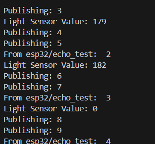
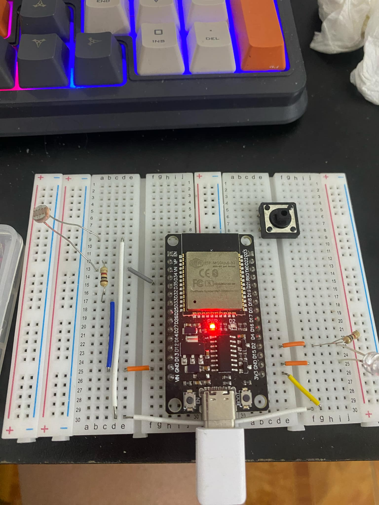
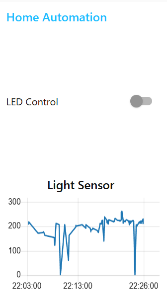

## Tên dự án
- Hệ thống chiếu sáng thông minh
## Tổng quan
- Tạo hệ thống chiếu sáng thông minh tự động điều chỉnh dựa trên mức độ ánh sáng xung quanh. Hệ thống sử dụng bo mạch phát triển ESP32 được kết nối với cảm biến ánh sáng và đèn LED . Hệ thống giao tiếp với môi giới MQTT trực tuyến, cho phép giám sát và điều khiển theo thời gian thực thông qua Bảng điều khiển Node-RED có thể truy cập từ máy tính và điện thoại thông minh
## Phần cứng
- ESP32
- LDR
- LED
## Phần mềm
-PlatformIO
-Giao thức MQTT(HiveMQ)
-Node-RED và Dashboard
## Đặc trưng
- Tự động điều chỉnh bật tắt ánh sáng dựa trên ánh sáng xung quanh
- Giám sát từ xa mức độ ánh sáng và trạng thái LED
- Kiểm soát thủ công thông qua Node-RED
## Thực hiện
- Đặt một mốc ánh sáng nhất định, nếu cảm biến đo đươc ánh sáng cao hơn mốc này thì đèn sẽ tắt và ngược lại
- Che hoặc để cảm biến ánh sáng lộ ra trong quá trình mô phỏng để thay đổi kết quả đo
- Sử dụng công tắc trên bảng điều khiển để điều khiển đèn LED theo cách thủ công
## Ứng dụng
- Tự động điều khiển hệ thống chiếu sáng trong nhà, thành phố để tiết kiệm năng lượng
- Theo dõi và kiểm soát điều kiện ánh sáng trong nhà kính phục vụ cho nông nghiệp
## Kết quả đo được

**Hình 1** 

**Hình 2**   

**Hình 3** 

## Kết nối với Node-red
-Do một lỗi nào đó nên em vẫn chưa thể kết nối với node-red để giám sát và điều khiển